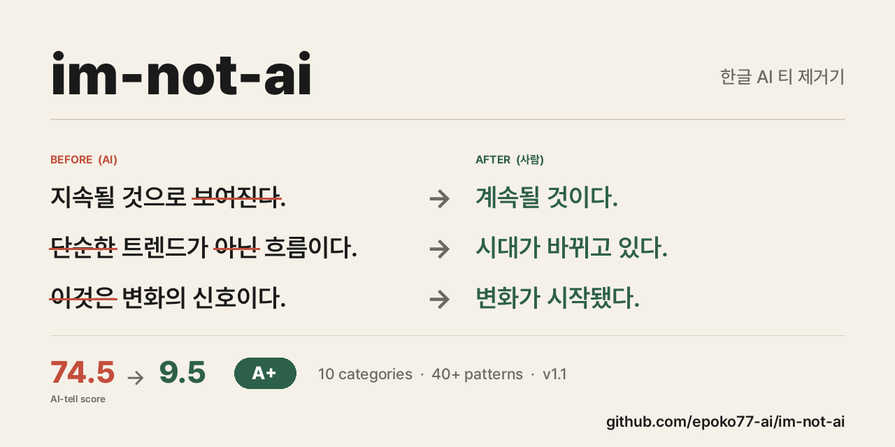

<p align="center">
  
</p>

# Humanize KR for Codex — 한글 AI 티 제거기 v1.6.1

[epoko77-ai/im-not-ai](https://github.com/epoko77-ai/im-not-ai)의 Codex 플러그인 포트입니다. 원본 공식 repo의 `v1.6.1` 기준으로 만들었고, KatFish/LREAD 기반 정량 점수 레이어와 `final.md` 통합 산출물 hotfix까지 반영했습니다.

AI(ChatGPT · Claude · Gemini 등)가 쓴 한글 글을 **내용은 한 글자도 건드리지 않고** 문체 · 리듬 · 표현만 자연스러운 한국어로 되돌리는 Codex plugin/skill입니다.

번역투, 과도한 영어 인용, 기계적 병렬("첫째 · 둘째 · 셋째"), "결론적으로 / 시사하는 바가 크다" 같은 AI 특유 관용구, 피동태 남용, 문두 접속사 남발, 이모지·불릿 남용 등 **10대 카테고리 × 40+ 서브 패턴**을 심각도(S1/S2/S3)로 분류해 스팬 단위로 탐지한 뒤, 윤문합니다.

## 상태

이 repo는 공식 Claude Code 스킬이 아니라, 같은 taxonomy/playbook/agent prompt를 Codex plugin/skill 구조로 옮긴 community adapter입니다.

- 원본 프로젝트: `epoko77-ai/im-not-ai`
- Codex plugin name: `im-not-ai-codex`
- Codex skill name: `humanize-korean`
- Plugin source path: `plugins/im-not-ai`
- Plugin version: `v1.6.1`
- Original version: `v1.6.1`
- Latest release: [`v1.6.1`](https://github.com/Squirbie/im-not-ai-codex/releases/tag/v1.6.1)
- Original release: [`epoko77-ai/im-not-ai v1.6.1`](https://github.com/epoko77-ai/im-not-ai/releases/tag/v1.6.1)
- Last upstream sync: `6138697` (v1.6.1 final.md 통합 산출물 hotfix)

## 버전 정책

이 Codex 포트는 원본 `epoko77-ai/im-not-ai`의 버전을 따라갑니다. 예를 들어 원본이 `v1.6.1`이면 이 plugin도 `v1.6.1`로 배포합니다. 나중에 원본이 `v1.6.2`나 `v1.7.0`으로 올라가면, 원본 변경분을 반영한 뒤 같은 버전으로 새 release를 만듭니다.

즉 `im-not-ai-codex v1.6.1`은 "원본 `im-not-ai v1.6.1`의 taxonomy, metrics layer, fast/strict workflow를 Codex plugin 구조로 옮긴 배포판"이라는 뜻입니다. 전체 변경 내역은 [RELEASE_NOTES.md](./RELEASE_NOTES.md)를 참고하세요.

## 왜 한글 특화인가

영어권 humanizer(QuillBot · Hix · Undetectable AI)는 한국어에 약합니다. 한글 AI 글의 티는 대부분 **영어 번역투**에서 나옵니다.

- "AI 기술을 **통해** 효율을 높**일 수 있다**" -> "AI로 효율을 높인다"
- "이에 **있어서** 중요한 **점은**" -> "여기서 중요한 건"
- "~**에 의해** 생성된" -> "~가 만든"
- "**결론적으로**, 이는 **시사하는 바가 크다**" -> (삭제)

이 하네스는 그 한글 고유 패턴을 SSOT로 정리하고, 탐지·윤문·내용 감사·자연스러움 검증을 역할별로 수행합니다.

## 4대 철칙

1. **의미 불변** — 사실 · 주장 · 수치 · 고유명사 · 직접 인용은 100% 원문 보존.
2. **근거 기반** — 탐지된 span에만 수술적 수정. 탐지 없는 구간은 건드리지 않음.
3. **장르 유지** — 칼럼을 문학으로, 리포트를 에세이로 옮기지 않음.
4. **과윤문 금지** — 변경률 30% 초과 시 경고, 50% 초과 시 강제 중단.

## 아키텍처 (v1.6.1)

원본 `v1.6`의 핵심은 v1.5 monolith fast path 앞에 **KatFish/LREAD 기반 정량 점수 레이어**를 붙인 것입니다. 연결어미 뒤 쉼표(C-11), 쉼표 포함률, 결산 lexicon, 안전 균형 lexicon 같은 신호를 먼저 계산해 monolith 입력에 함께 넣습니다. `v1.6.1`은 fast mode 산출물을 `final.md` 하나로 통합해 메타데이터를 HTML 주석 블록으로 보존합니다.

**Fast 모드 (디폴트, 5,000자 이하 권장)**

```text
입력 텍스트
    ↓
[metrics.py]         -- KatFish/LREAD 기준 정량 점수 계산
    ↓
[humanize-monolith] -- 점수 + quick-rules 기반 탐지 -> 윤문 -> 자체검증
    ↓
final.md            -- 본문 + <!-- HUMANIZE-SUMMARY --> 메타 블록
```

**Strict 모드 (`--strict` 또는 8,000자+ 자동 승급)**

```text
입력 텍스트
    ↓
[ai-tell-detector]        -- 탐지 (span · category · severity)
    ↓
[korean-style-rewriter]   -- finding 기반 수술적 윤문
    ↓
[검증]
    ├─ [content-fidelity-auditor]  -- 13항 체크리스트로 의미 동등성 감사
    └─ [naturalness-reviewer]      -- 탐지 재실행으로 잔존·과윤문 판정
    ↓
[오케스트레이터 종합]
    ├─ accept               -> final.md + summary.md
    ├─ rewrite_round_2      -> 2차 윤문 (최대 3회)
    ├─ rollback_and_rewrite -> 문제 edit 롤백
    └─ hold_and_report      -> 사람 검토 권고
```

원본 Claude Code판은 `Agent`, `TeamCreate`, slash command, `model: opus` 메타데이터를 사용합니다. 이 Codex 포트는 같은 역할 정의와 reference 문서를 유지하되, Codex plugin의 `humanize-korean` skill workflow 안에서 role pass로 실행하도록 바꿨습니다.

## 7개 역할 reference

| 역할 | 모드 | 설명 |
|------|------|------|
| `humanize-monolith` | Fast 디폴트 | 정량 점수와 quick-rules 기반 단일 흐름 탐지·윤문·자체검증 |
| `ai-tell-detector` | Strict | span 단위 JSON 탐지 리포트 생성 |
| `korean-style-rewriter` | Strict | finding 기반 수술적 윤문, 변경률 모니터링 |
| `content-fidelity-auditor` | Strict | 의미 동등성 감사, 훼손 시 롤백 지시 |
| `naturalness-reviewer` | Strict | 잔존 AI 티 · 과윤문 · 자연도 판정 |
| `korean-ai-tell-taxonomist` | 별도 reference | 분류 체계 유지·확장 판단 |
| `humanize-web-architect` | 옵션 | Next.js/Vercel 웹 서비스 확장 설계 |

## AI 티 분류 체계 (요약)

| ID | 대분류 | 대표 서브 패턴 |
|----|-------|---------------|
| A | 번역투 | "~를 통해", "~에 대해", "~에 있어서", 이중 피동 "~되어진다", "가지고 있다" |
| B | 영어 인용·용어 과다 | 과도한 괄호 병기, 번역 가능한 영어 그대로 |
| C | 구조적 AI 패턴 | 기계적 "첫째/둘째/셋째", 과도한 불릿·헤딩·이모지 |
| D | AI 특유 관용구 | "결론적으로", "시사하는 바가 크다", "주목할 만하다", "혁신적인" |
| E | 리듬 균일성 | 문장 길이 표준편차 낮음, 동일 종결어미 반복, 단문 일변도, 쉼표 분절 길이 |
| F | 수식·중복 | "매우", "정말", 동의어 이중 수식, "~적/~성/~화" 남발 |
| G | Hedging 남용 | "~할 수 있을 것으로 보인다" 다중 완곡, 안전 균형 lexicon |
| H | 접속사 남발 | 문두 "또한/따라서/즉/나아가" 연속 |
| I | 형식명사 과다 | "것이다", "점", "수", "바", "~할 필요가 있다" |
| J | 시각 장식 남용 | 과도한 **볼드**, "따옴표", 대시 남발 |

전체 40+ 서브 패턴과 처방은 plugin 내부 reference 문서에 들어 있습니다.

- [`quick-rules.md`](plugins/im-not-ai/skills/humanize-korean/references/quick-rules.md) — v1.6 fast path용 S1/S2 슬림 룰북
- [`ai-tell-taxonomy.md`](plugins/im-not-ai/skills/humanize-korean/references/ai-tell-taxonomy.md) — strict mode용 전체 분류 체계
- [`rewriting-playbook.md`](plugins/im-not-ai/skills/humanize-korean/references/rewriting-playbook.md) — 카테고리별 윤문 처방
- [`metrics.py`](plugins/im-not-ai/skills/humanize-korean/references/metrics.py) + [`baseline.json`](plugins/im-not-ai/skills/humanize-korean/references/baseline.json) — KatFish/LREAD 정량 점수 레이어

## 심각도 & 품질 등급

**심각도**

- **S1 결정적**: 한 번만 나와도 AI 확신. 무조건 제거.
- **S2 강함**: 1~2회 허용, 3회 이상 반복 시 제거.
- **S3 약함**: 다른 패턴과 중첩될 때만 문제.

**품질 등급 (윤문 후)**

- **A**: S1 0건, S2 2건 이하, 변경률 10~25%, 자체검증 6항 통과
- **B**: S1 0건, S2 4건 이하, 자체검증 5항 이상 통과
- **C**: S1 1~2건 또는 자체검증 4항 이하 → strict/2차 윤문 권고
- **D**: S1 3건 이상 또는 변경률 50% 초과 → 작업 중단/사람 검토

## 설치

Codex plugin marketplace로 추가합니다.

```bash
codex plugin marketplace add Squirbie/im-not-ai-codex
```

그 다음 Codex를 재시작하고, Plugins 화면에서 `im-not-ai Codex`를 선택한 뒤 `Humanize Korean`을 설치하면 됩니다.

로컬에서 먼저 테스트하려면:

```bash
codex plugin marketplace add /absolute/path/to/im-not-ai-codex
```

Codex plugin/marketplace 구조는 공식 문서를 기준으로 맞췄습니다: https://developers.openai.com/codex/plugins/build

## 다른 community 포트

원본 README에는 이 Codex 포트와 별도로 opencode 기반 Web UI 포트도 안내되어 있습니다.

- Codex plugin: [`Squirbie/im-not-ai-codex`](https://github.com/Squirbie/im-not-ai-codex)
- Web UI: [`im-not-ai-ocx.illuwa.click`](https://im-not-ai-ocx.illuwa.click/)

## 사용법

Codex에서 자연어로 부르면 됩니다.

```text
humanize-korean으로 이 글 AI 티 없애줘:

[윤문할 한글 초안]
```

트리거 예시:

- `AI 티 없애줘`
- `GPT 문체 제거해줘`
- `사람이 쓴 것처럼 윤문해줘`
- `번역투 제거`
- `한글 AI 윤문`
- `humanize-korean으로 윤문해줘`

정밀하게 돌리고 싶으면 끝에 `--strict`를 붙입니다. 8,000자 이상 장문이나 부분 재실행 요청은 strict mode로 자동 전환됩니다.

```text
humanize-korean으로 이 글 AI 티 없애줘 --strict:

[긴 글]
```

## 산출물

Fast 모드는 `_workspace/{run_id}/` 아래에 최소 산출물을 남깁니다.

| 파일 | 내용 |
|------|------|
| `01_input.txt` | 원문 그대로 |
| `00_metrics.json` | KatFish/LREAD 기반 정량 점수 (가능할 때) |
| `01_input_with_metrics.txt` | 점수 블록 + 원문 결합 입력 |
| `final.md` | 윤문본 + 끝부분 `<!-- HUMANIZE-SUMMARY -->` HTML 주석 메타 블록 |

Strict 모드는 검증 산출물을 더 자세히 남깁니다.

| 파일 | 내용 |
|------|------|
| `01_input.txt` | 원문 그대로 |
| `02_detection.json` | AI 티 탐지 리포트 |
| `03_rewrite.md` | 윤문본 |
| `03_rewrite_diff.json` | 변경 diff |
| `04_fidelity_audit.json` | 의미 보존 감사 |
| `05_naturalness_review.json` | 자연스러움 리뷰 |
| `final.md` | 최종 윤문본 |
| `summary.md` | 점수 변화·주요 변경·등급 요약 |

## 결과가 마음에 안 들면

그대로 말씀하시면 됩니다. 재실행·수정 명령을 따로 외울 필요 없습니다.

- **"이 문단만 다시 윤문해줘"** — 해당 구간만 재시도
- **"번역투만 더 손봐줘"** — 특정 카테고리만 재처리
- **"윤문 강도 낮춰줘"** — 보수적 윤문
- **"원문 톤을 더 살려줘"** — 변경률 상한을 낮춰 원문 유지
- **"2차 윤문해줘"** — 현재 결과를 한 번 더 다듬기

## Do-NOT List (탐지·윤문 대상 제외)

- 수치 · 단위 · 날짜
- 고유명사 · 인명 · 제품명 · 모델명
- 큰따옴표 내부 직접 인용
- 법률 · 규정 조문
- 학술 개념어와 업계 표준 영어 약어(LLM · GPU · MCP · API 등)

## v1.6.1 핵심 변경

공식 v1.6은 v1.5 monolith 구조를 유지하면서 정량 점수 레이어를 추가한 릴리즈입니다.

- **본진 분류 체계 v1.6** — `C-11` 연결어미 뒤 쉼표, `C-12` 쉼표 포함률, `E-5/E-6` 쉼표 기반 리듬 지표, `G-3` 안전 균형 lexicon 추가
- **정량 점수 레이어** — `metrics.py`와 `baseline.json`으로 8개 지표를 계산하고 `risk_band`와 z-score를 monolith 입력에 prepend
- **Fast mode 도구 호출 캡 보존** — monolith가 별도 파일을 더 읽지 않도록 `01_input_with_metrics.txt`에 점수와 원문을 함께 넣음
- **v1.6.1 hotfix** — fast mode 산출물을 `final.md` 하나로 통합하고, 변경률·등급·자체검증·하이라이트는 `<!-- HUMANIZE-SUMMARY -->` HTML 주석 블록에 저장

공식 검증에서는 v1.5가 약하게 잡던 연결어미 뒤 쉼표 지표가 개선됐고, 5편 일괄 테스트에서 등급 A와 도구 호출 캡이 유지됐다고 README에 정리되어 있습니다.

## v1.5 핵심 변경

공식 v1.5는 v1.2~v1.4의 실험을 폐기하고 v1.1 단순 구조로 롤백한 뒤, 기본 경로에 monolith fast path를 추가한 릴리즈입니다.

- **v1.2~v1.4 폐기** — voice profile, candidate pool, promotion checklist, sample collection 제거
- **Monolith Fast Path 신설** — `humanize-monolith`가 한 흐름에서 탐지·윤문·자체검증 처리
- **`quick-rules.md` 신설** — 본진 taxonomy에서 S1/S2 핵심만 추린 fast 전용 룰북
- **Strict 모드 보존** — 정밀 검증·장문·부분 재실행은 기존 5인 파이프라인 유지
- **분류 체계 본진 유지** — C-9, C-10, D-7, H-3, I-3, I-4 보강 등 v1.2~v1.3.1의 유효 패턴은 보존

공식 검증 결과 기준, 같은 2,604자 칼럼에서 v1.4 detector 1콜은 7분 58초였고, v1.5 monolith 1콜은 3분 28초였습니다. 5인 파이프라인 25분 대비 약 86% 단축이라는 판단으로 v1.5가 발행됐습니다.

공식 발행 직후 본질 테스트에서도 5편 모두 등급 A, 자체검증 6/6 통과, 변경률 10~25% 안전 구간을 기록했다고 README에 정리되어 있습니다.

## Claude Code 버전과 다른 점

원본은 Claude Code 프로젝트 구조를 씁니다.

- `.claude/skills/humanize-korean/SKILL.md`
- `.claude/agents/*.md`
- `.claude/commands/humanize.md`
- `.claude/commands/humanize-redo.md`

이 포트는 원본의 taxonomy, playbook, quick rules, agent role reference는 유지하되 Codex plugin 구조로 감쌌습니다.

- `plugins/im-not-ai/.codex-plugin/plugin.json`
- `.agents/plugins/marketplace.json`
- `plugins/im-not-ai/skills/humanize-korean/SKILL.md`
- `plugins/im-not-ai/skills/humanize-korean/references/`

Claude Code의 `/humanize`, `/humanize-redo` 슬래시 커맨드는 Codex에서 그대로 쓰지 않습니다. 대신 `humanize-korean` 스킬 트리거와 자연어 후속 명령으로 실행합니다.

## 웹 서비스 확장 (옵션)

원본에는 Next.js 15 App Router + Vercel Fluid Compute + AI Gateway 기반 웹앱 설계 reference가 포함돼 있습니다. 이 Codex 포트에서도 `references/web-service-spec.md`를 보존합니다.

로드맵은 원본과 동일하게 v0 MVP(익명·단일 호출) -> v1(로그인·히스토리) -> v2(Pro/Team · API · 웹훅) -> v3(Chrome Extension) -> v4(일본어·중국어 확장)입니다.

## 원본 출처

Original project by [@epoko77-ai](https://github.com/epoko77-ai), licensed under MIT. 이 포트도 MIT License를 유지하며, 원본 reference 파일은 그대로 보존하고 Codex adapter layer만 추가했습니다.

정확한 원본 commit과 파일 매핑은 [SOURCE.md](./SOURCE.md)를 참고하세요.

## Privacy

이 플러그인은 Codex skill instruction과 Markdown reference 파일만 포함합니다. 별도 MCP 서버, 앱 connector, 외부 API 호출, telemetry endpoint, background service를 추가하지 않습니다.

단, Codex 자체는 사용자의 Codex/OpenAI 설정에 따라 프롬프트를 처리할 수 있습니다. 민감한 글은 현재 Codex workspace와 계정 설정이 적절한지 확인한 뒤 넣으세요.

## Terms

이 community port는 MIT License로 제공됩니다. OpenAI 공식 플러그인이 아니며, `epoko77-ai/im-not-ai`의 공식 Claude Code edition도 아닙니다.
